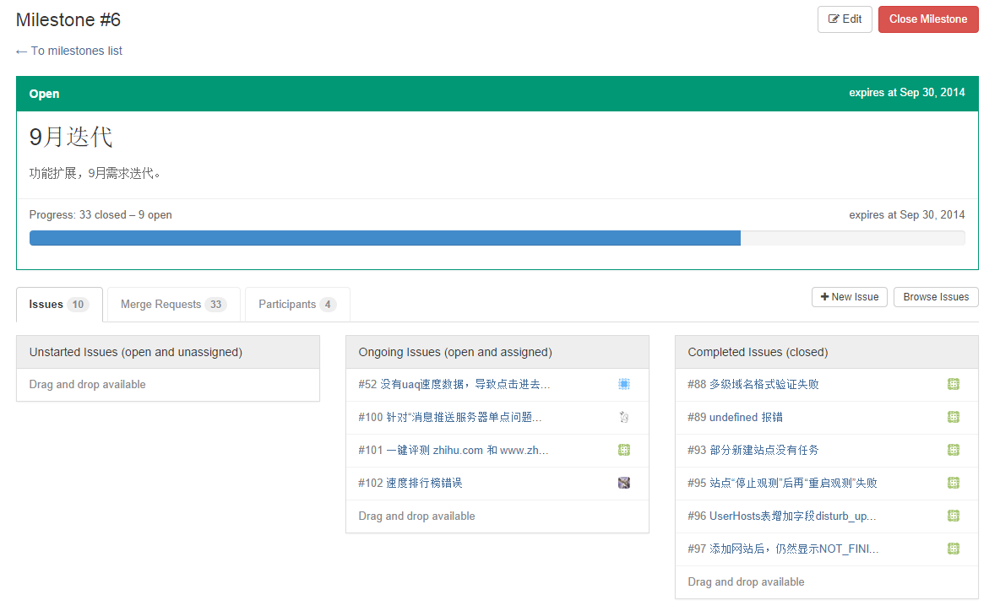

# Issue管理策略

## 说明

针对一个需求迭代周期，当完成milestone的建立、需求分解等工作之后，接下来的工作即是将需求点抽象成一个个的issue，并且这些issue都应该指定milestone。

## 参考文章

*TODO*

## ChangeLog

- 2014/9/12
    - create
- 2014/9/24
    - update

## 目录

- 正文
    - 1 issue的创建
    - 2 issue的标题
    - 3 issue的描述
    - 4 issue的assigneer
    - 5 issue的milestone
    - 6 issue的labels
    - 7 issue的关闭
    - 8 在milestone中管理issue

## 正文

### 1 issue的创建

可以通过gitlab的 *issues* 页面进行创建操作，需要注意的是，

- 规范 *issue* 的标题
- 针对不同类型的issue，尽量给出详尽的issue*描述（ *description* ）
- 一般情况下，不允许创建没有 *assigneer* （责任人）的issue
- 一般情况下，不允许创建没有 *milestone* （里程碑）的issue
- 尽量为你的issue贴上适合的 *labels* （标签）
- ...

### 2 issue的标题

github上 *contributors* 人数较多的开源项目中，有一种比较好的issue标题命名规范，我觉得可以借鉴，

**[xx][xx]xx**

这种标题将一些额外的信息附加在其上，让浏览者见名知意。

这里，我们并不强制，但是 **推荐使用** 这种命名规范，比如：

- **`[用户反馈][紧急]站点“停止观测”后再“重启观测”失败`**
- **`[性能优化][web]UI界面需要使用伪静态化链接`**
- **`[九月迭代][bug]速度排行榜错误`**
- ...

其中，示例中`[]`中的修饰词不作强制规定，视具体情况而定。

### 3 issue的描述

一个issue拥有了一个见名知意的标题后，更加应该拥有一个良好的描述（ *description* ）。

因为issue的用途比较广泛，比如，

- 用于阐述功能需求点（ *feature point* ）
- 用于阐述bug、问题等
- 用于提出建议、描述反馈等
- ...

可见，清晰的issue描述是至关重要的。（ *如有必要，可以使用`Markdown`语法，作一个图文并茂的描述就更好了* ）

### 4 issue的assigneer

一般情况下，我们不允许创建一个不明确指定 *assigneer* 的issue。理论上一个issue都应该和一个 **责任人** 相关联。（期间变更 *assigneer* 当然是允许的）

### 5 issue的milestone

一般情况下，我们不允许创建一个不明确指定 `milestone` 的issue。理论上，一个issue都应该被一个milestone所约束。

不属于任何milestone的issue将会成为 **游离issue** ，不利于issue的管理。

### 6 issue的labels

个人觉得，issue管理的好与坏主要体现在 **每个issue是否被贴上了合适的labels** 。

issue的labels最忌讳： *取名随意* 、 *缺乏管理* 、 *数量泛滥*

下面列出了一些常用的labels类型，可供参考，

- `feature` 标识此issue是一项待实现的功能
- `bug` 标识此issue是一个bug
- `enhancement` 此issue将会描述一些待提升的问题，比如性能优化等方面
- `feedback` 此issue内容为用户的反馈

上述的几种类型labels是比较通用的，即， **任何一个issue，不管其内容是什么，必定是属于上述四种类型中的一类** 。

所以，我们在创建issue时，为issue贴的labels必定是上述四种中的一个或者多个！

除了上述几个通用必选的类型之外，我们可能会有一些特殊用途的labels，比如，

- `fixed` 标识`bug`类的issue已经被成功修复
- ...

（ *此处可能需要更多的讨论！* ）

需要注意的一点是，issue的 *labels*  **不要随意创建** ！

### 7 issue的关闭

当一个issue的生命周期结束之后，issue的 *assigneer* 应该及时的将其关闭！

这里，有一点需要提一下，

针对`bug`类的issue，我们现在的做法是，在完成相关修复之后，变更 *assigneer* ，将其指定为相关的QA，然后QA再去进行测试回归。

我个人觉得 **变更issue的assigneer为相关的测试者不是一个好的举措！** ，因为， *assigneer* 的作用是为issue指定相关的责任人，如果在修复完毕之后将其指定为QA，这样最后会造成这样一种后果，就是 **所有`bug`类的 *assigneer* 都是 QA** ！

**这样就很不利于`bug`类issue的回溯！**

推荐的做法，

issue的 *assigneer* 在修复完毕之后，可以在issue的 *comment* 中 **`@QA`** ，将相关的测试者加入到issue的 *participants* （参与者）中，这样相关的QA就会收到通知邮件，然后去做相应的测试工作，测试完毕之后在 *comment* 中留下测试结果。

### 8 在milestone中管理issue

如下图所示，

从图中可以很清楚的看出如下信息，

- milestone的相关信息，包括 **标题** 、 **内容** 、 **时间点** 以及 **此次迭代的进度** 等。
- 看到issues、合并请求以及本次迭代涉及到的参与者
- 在issues选项卡中，可以很清楚的看出， **还未开始的issues** ， **当前正在进行的issues** ，以及 **已经完成的issues** ，这些信息对整个迭代周期的把握很有帮助
- ...

